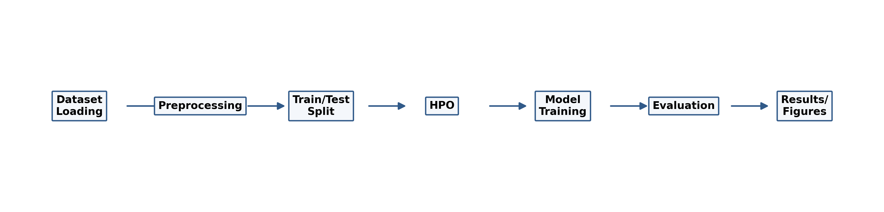
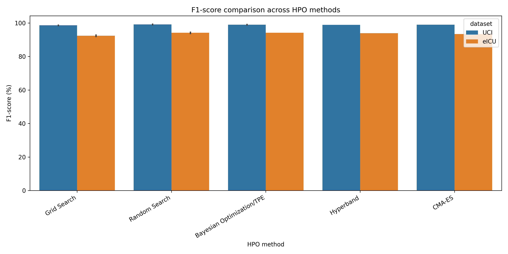
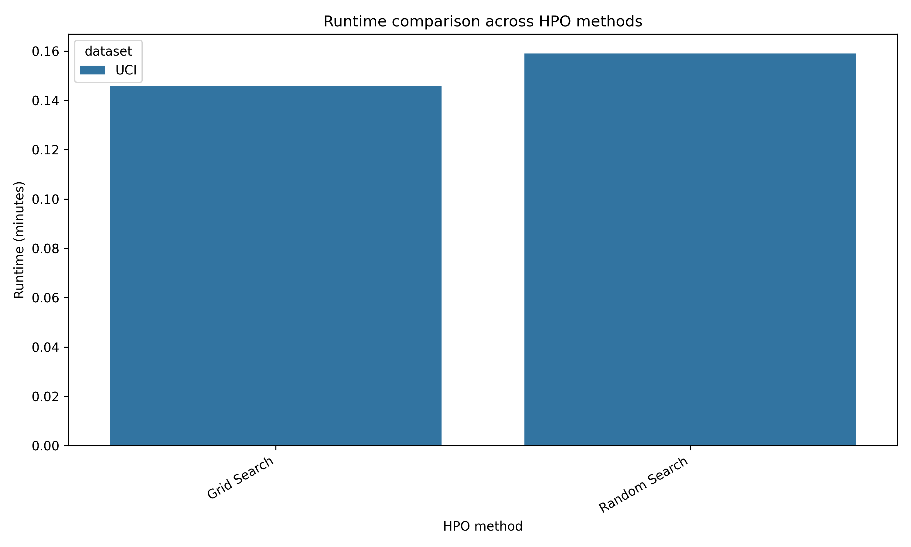
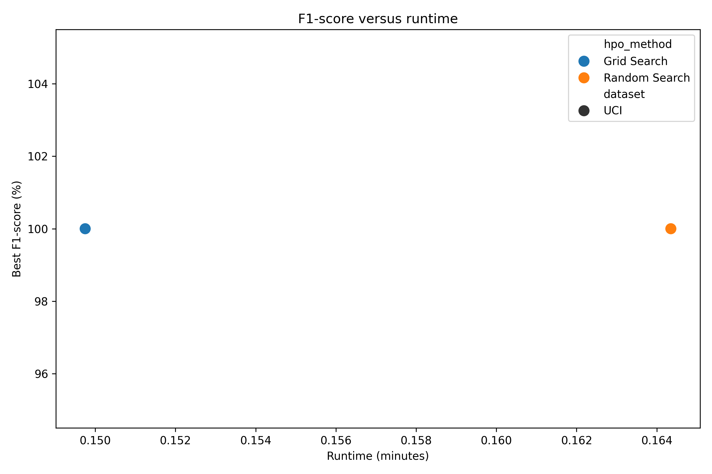
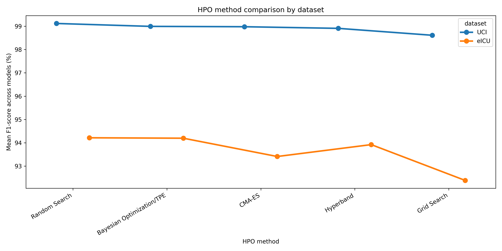

# CKD Hyperparameter Optimization Study


**A reproducible clinical ML research package that compares hyperparameter optimization strategies for Chronic Kidney Disease prediction, generates verified result tables and figures, and includes a Springer LNCS-style manuscript.**

**Paper:** *Comparative Evaluation of Hyperparameter Optimization Techniques for Chronic Kidney Disease Prediction: A Multi-Dataset Study*

**Author:** Tauqeer Sameer Bharde, Artificial Intelligence and Data Science Engineering, SIES Graduate School of Technology, Mumbai

## TL;DR

- One command runs the public UCI CKD experiment: `python src/main.py`
- Pipeline covers data loading, leakage-safe preprocessing, HPO, model training, evaluation, and plots
- Verified outputs are committed in `results/`, `paper/figures/`, and `docs/verification/`
- Public code reproduces UCI CKD results; eICU is discussed only as a credentialed-data extension
- This is a research/reproducibility package, not a diagnostic product

## Results Snapshot

| Public Pipeline Result | Held-out F1 |
| --- | ---: |
| SVM + Grid Search | 100.0% |
| SVM + Random Search | 100.0% |
| Random Forest + Random Search | 98.99% |

Dataset: **UCI Chronic Kidney Disease**.

Interpretation: benchmark reproducibility-run performance, not clinical-use evidence.

## Visual Outputs











## Why This Matters

Clinical ML papers often report model scores without enough detail about tuning, leakage prevention, runtime cost, or reproducibility. This repository packages the full experiment path so a reviewer or recruiter can inspect the code, rerun the benchmark, audit outputs, and read the manuscript from the same repo.

## Quick Start

```bash
git clone https://github.com/tauqxxr7/ckd-hpo-study.git
cd ckd-hpo-study
pip install -r requirements.txt
python src/main.py
```

This regenerates:

- `results/performance_table.csv`
- `results/runtime_table.csv`
- `paper/figures/*.png`
- local trained models in `results/models/` ignored by Git

## Key Contributions

- Built an end-to-end CKD prediction pipeline that runs from dataset loading to verified figures
- Compared Grid Search and Random Search under the public UCI reproducibility pipeline
- Reported performance and runtime together instead of optimizing score alone
- Used scikit-learn pipelines to keep imputation, encoding, scaling, and fitting leakage-safe
- Included Springer LNCS manuscript source, bibliography, reviewer checklist, and Overleaf upload package
- Separated public UCI reproducibility from credentialed eICU discussion to avoid unverifiable claims
- Added verification artifacts so results are inspectable without rerunning the project

## Research Paper

- [Overleaf upload package](paper/overleaf_upload.zip)
- Manuscript source: [`paper/main.tex`](paper/main.tex)
- References: [`paper/references.bib`](paper/references.bib)

If `paper/ckd_hpo_manuscript.pdf` is not present, upload the `/paper` folder to Overleaf and compile using the Springer LNCS template.

## Verification Proof

Verification artifacts are available in [`docs/verification/`](docs/verification/):

- [`pipeline_run.txt`](docs/verification/pipeline_run.txt)
- [`syntax_check.txt`](docs/verification/syntax_check.txt)
- [`results_preview.md`](docs/verification/results_preview.md)
- [`figures_preview.md`](docs/verification/figures_preview.md)

## Repository Quality Checklist

- [x] End-to-end pipeline runs
- [x] Figures generated
- [x] Results CSV generated
- [x] Paper manuscript included
- [x] References included
- [x] Ethics statement included
- [x] Reproducibility statement included
- [x] Raw clinical data excluded
- [x] Reviewer checklist included

## Project Structure

```text
ckd-hpo-study/
|-- README.md
|-- data/
|   `-- README.md
|-- docs/
|   `-- verification/
|-- notebooks/
|   `-- ckd_hpo_experiments.ipynb
|-- paper/
|   |-- main.tex
|   |-- references.bib
|   |-- REVIEWER_CHECKLIST.md
|   |-- overleaf_upload.zip
|   `-- figures/
|-- results/
|   |-- performance_table.csv
|   `-- runtime_table.csv
|-- src/
|   |-- data_loader.py
|   |-- main.py
|   |-- preprocessing.py
|   |-- train_models.py
|   |-- optimize_hpo.py
|   |-- evaluate.py
|   `-- plot_results.py
|-- requirements.txt
|-- LICENSE
`-- .gitignore
```

## Technical Notes

- Modular ML pipeline: loading, preprocessing, training, HPO, evaluation, plotting
- Leakage-safe preprocessing fitted inside training folds
- Random seed: `42`
- CPU-only execution; no GPU required
- Generated figures and CSVs committed for reviewer inspection
- Raw/private clinical data excluded by `.gitignore`

## Datasets

- **UCI CKD:** public benchmark used by the runnable pipeline
- **eICU:** credentialed PhysioNet dataset discussed as a summarized extension; raw data are not distributed

## Limitations

- UCI CKD is a small benchmark dataset
- eICU requires credentialed PhysioNet access
- No external clinical validation yet
- Not a diagnostic tool

## Final Note

This project is designed to show research engineering discipline: reproducible experiments, defensible claims, clear clinical-data boundaries, generated artifacts, and a manuscript-ready reporting structure in one repository.

## Citation

```text
Bharde, T. S. Comparative Evaluation of Hyperparameter Optimization Techniques
for Chronic Kidney Disease Prediction: A Multi-Dataset Study.
SIES Graduate School of Technology, Mumbai, Maharashtra, India.
```

## License

This repository is released under the [MIT License](LICENSE).
